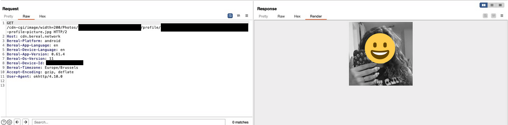
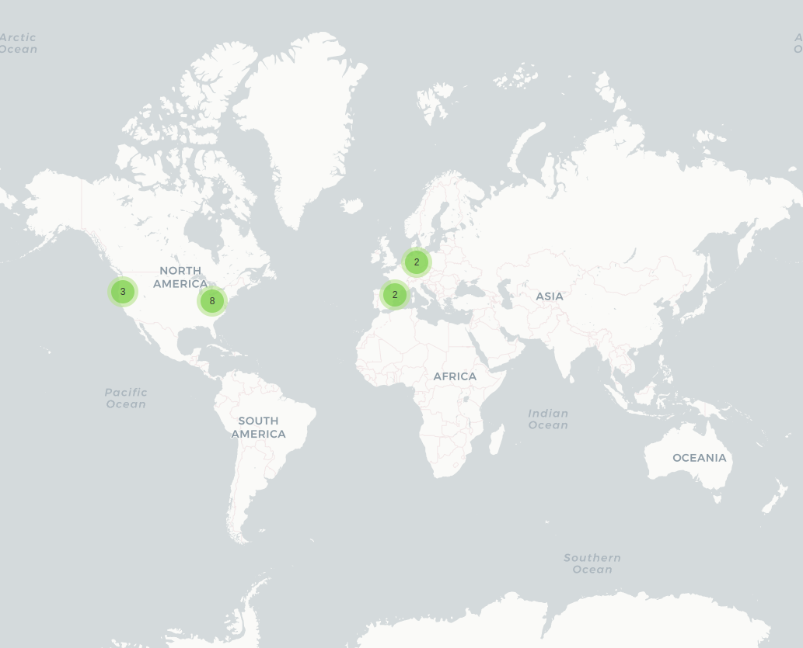
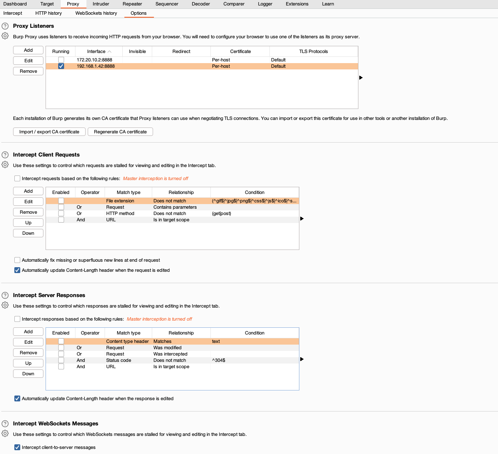
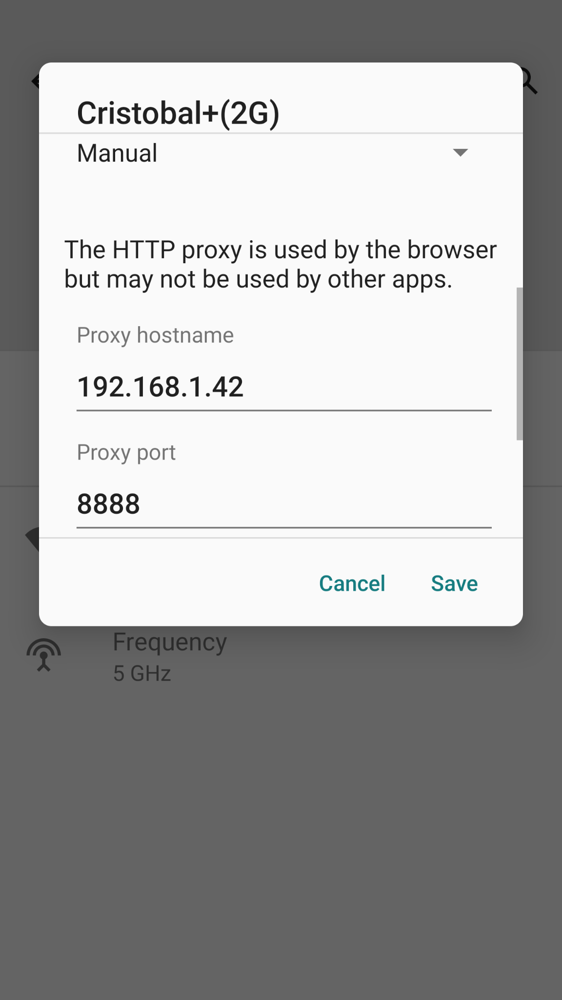
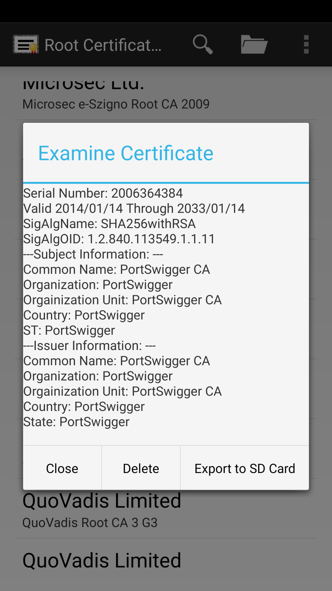

# Dissecting BeReal
Participants: [Adrián Soria Montoya](https://github.com/CyAdriDe), [Cristian Fernández Jiménez](https://github.com/crisfj00), [Erika Morales Muñoz](https://github.com/ErikaMorales8), [Sergi Ger](https://github.com/sergiger) & [Yuanyu Zhou](https://github.com/zyy55)<br>

## Table of contents
* [General info](#general-info)
* [Takeaways](#takeaways)
* [Project](#project)
* [Challenges and problems](#challenges-and-problems)
* [References](#references)
## General info
TMA Research project based on Privacy & Ethics Monitoring, targeting the brand new social network, BeReal.<br>
The repository is organised as follows:
* documentation: Extra information gathered.
* resources: Captured traffic.
* results: Generated maps and user images captured.
* src: Source code.

## Takeaways
*  Certain information in the HTTP request header needs to be ciphered or protected. User image URLs are accessible by anyone who knows them, no matter whether they are public, private, blurred or made in the past.
<p align="center">

</p>

*  Data is travelling out of Europe, in our main data capture, 11 endpoints are reached in the USA, as Firebase, Logging or some Geolocation services are located there. However, we want to make clear that the sensitiveness of this data is not assessed, as payload could not be decrypted.
<p align="center">

</p>

## Project

### Pre-requisites
Project has been developed making use of:
* Python version: 3.10.5
* [Burp Community Edition](https://portswigger.net/burp/communitydownload)
* [BeReal (Android version)](https://play.google.com/store/apps/details?id=com.bereal.ft&gl=US)
* [ProtonVPN](https://protonvpn.com/)
* [Android Studio](https://developer.android.com/studio/)
* [ApkTool](https://ibotpeaches.github.io/Apktool/)
* (Optional) [Frida](https://frida.re/docs/home/)
* (Optional) [Frida Server](https://github.com/frida/frida/releases/)

### Traffic capture
For capturing network traffic packets from BeReal we will use Burp Suite.
Proxy configuration must be done as follows:
<p align="center">

</p>

Once the proxy listening, we will update the configuration in the Android Device.
<p align="center">

</p>

In order to decrypt captured traffic, we may install Burp's certificate as a system cert. <br>
Firstly, export the certificate in the Burp Proxy settings (which will give us a .der certificate). Then, [this guide](https://medium.com/hackers-secrets/adding-a-certificate-to-android-system-trust-store-ae8ca3519a85) can be followed, or just execute the following commands (android device must be rooted and connected to the PC).
```
$ mv <exported_cert_file> $(openssl x509 -inform PEM -subject_hash_old -in <exported_cert_file>| head -1).0 
$ adb root && adb remount 
$ adb push $(openssl x509 -inform PEM -subject_hash_old -in <exported_cert_file>| head -1).0 /system/etc/security/cacerts/ 
$ adb shell chmod 644 /system/etc/security/cacerts/$(openssl x509 -inform PEM -subject_hash_old -in <exported_cert_file>| head -1).0 
$ adb reboot
```
Now, the certificate is available in **Settings --> Security --> Trusted Credentials**.
<p align="center">

</p>

Remember to change the name of the exported cert. Normally, this would be enough to see encrypted traffic, but some applications may require to be modified. For this, we use Android Studio. <br>
We decompile the APK with APKTOOL:
```
$ apktool d <path_to_apk>
```
Then, the network config file must be modified as follows:
<p align="center">

</p>

And we connect this configuration file by adding: **android:networkSecurityConfig="@xml/network_security_config"**.

Finally, we may recompile the app and install it by running:
```
$ apktool b BeReal-patched.apk && adb install BeReal-patched.apk
```
At this moment, everything should work properly, but we encountered another problem. <br>
The App has SSL Pinning (which did not have a few months ago), and we need to bypass it. <br>
We encourage you to try [this tutorial](https://redfoxsec.com/blog/ssl-pinning-bypass-android-frida/), but it does not work since it has some kind of blockage, that goes further than our knowledge.

Nevertheless, if you the application is launched without the proxy, a later proxy activation will do the trick.<br> We deduced that the problem is due to authentication petitions.

### Running the project
To run this project, you may follow these commands:
```
$ pip install -r requirements.txt 
$ cd src 
$ python3 main.py 
```

### Execution results
* A page will open in the browser with a map of the world showing the location of all endpoints that received data from the user.
* All images that have been shared clearly through the traffic (no encryption), are deployed on a HTML table.
In some cases, it is possible that the browser will not open. The created files can be located in the resources folder.

## Challenges and problems
* Payload decryption required to root the Android phone, which was not possible in all our devices.
* Furthermore, the use of an unrecognized proxy certificate was noticed by BeReal in different stages, making connection requests unavailable in most cases.
* Burp Suite Proxy only allows to recover HTTP traffic. Besides, it has no feature to save the capture data as it comes, not being possible to feed the Python script in real-time.
* Several mobile Proxy applications have been used with poor results, as PCAPdroid, VirtualXposed, tPacketCapture or VNet. The latter helped us find the critical image URL, that was accessible by anyone.
* Different packet analyzers have been used with poor results, as NetworkMiner, CharlesProxy or Wireshark.

## References
### BeReal official sites
* https://bere.al/en/privacy
* https://bere.al/en/terms

### News about BeReal
* https://www.lavanguardia.com/tecnologia/redes-sociales/20221008/8558648/bereal-seguro-son-todos-datos-recopila-red-social-moda-pmv.html
* https://www.businessinsider.com/guides/tech/is-bereal-safe

### Reverse-engineering BeReal
* https://shomil.me/bereal/
* https://github.com/userbradley
* https://blog.oscars.dev/posts/hacking_bereal_with_man_in_the_middle/
* https://packettotal.com/app/analytics?id=97069f5922d627964430baa636765be8&name=conn

### Mobile phone traffic capture
* https://stackoverflow.com/questions/9555403/capturing-mobile-phone-traffic-on-wireshark
* https://stackoverflow.com/questions/19664129/is-it-possible-to-edit-androidmanifest-xml-after-packaging-the-apk
* https://www.taosoftware.co.jp/en/android/packetcapture/
* https://www.netresec.com/?page=Blog&month=2014-02&post=HowTo-install-NetworkMiner-in-Ubuntu-Fedora-and-Arch-Linux
* https://community.tealiumiq.com/t5/Tealium-for-Android/Setting-up-Charles-to-Proxy-your-Android-Device/ta-p/5121

### Similar works
* https://www.researchgate.net/profile/Nedaa-Barghuthi/publication/274467400_Social_Networks_IM_Forensics_Encryption_Analysis/links/5b1f5894458515270fc48a58/Social-Networks-IM-Forensics-Encryption-Analysis.pdf
* https://www.researchgate.net/publication/328911499_Network_Forensics_Analysis_of_iOS_Social_Networking_and_Messaging_Apps
* https://discovery.upc.edu/discovery/fulldisplay?docid=cdi_arxiv_primary_1903_03196&context=PC&vid=34CSUC_UPC:VU1&lang=ca&search_scope=MyInst_and_CI&adaptor=Primo%20Central&tab=Everything&query=any,contains,GDPR%20analysis%20of%20social%20networks&offset=0
* https://www.mdpi.com/2078-2489/13/1/26/htm
* https://journals.plos.org/plosone/article/file?id=10.1371/journal.pone.0209075&type=printable
